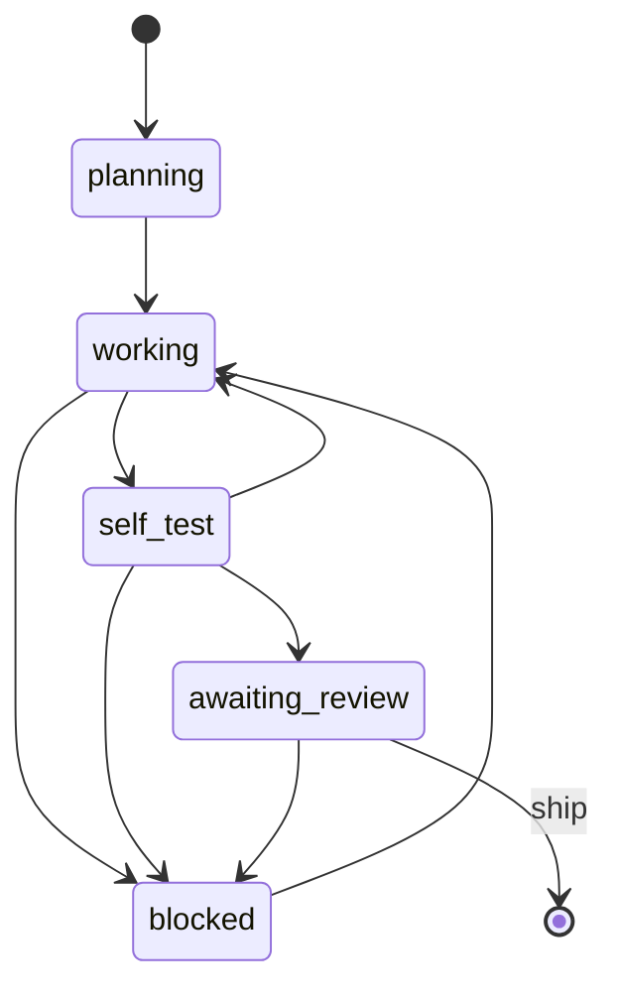
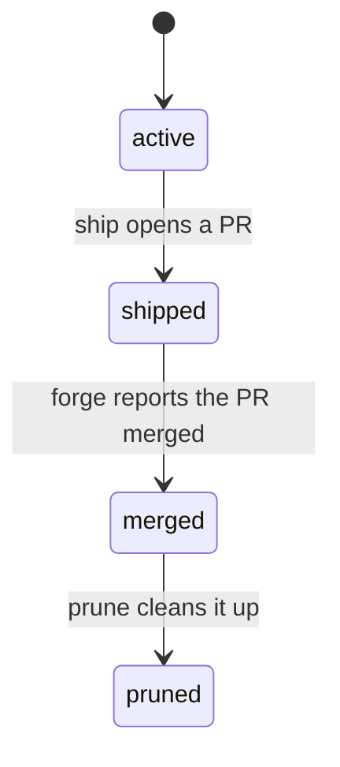

# argus, a Deterministic Agent Supervisor

[](https://github.com/Elysium-Labs-EU/argus)

argus supervises a fleet of parallel AI coding agents and ships each one's work to a pull request. It runs the mechanical half of that supervision as plain Go rather than inside an LLM. It spawns workers in isolated git worktrees, tracks each one through a typed state machine, and gates every diff against the real `git diff` before it can ship. The LLM re-enters only to review the risky minority that the deterministic gate will not clear on its own.

The point is verification, not just coordination. The gate trusts measured ground truth over whatever a worker reports about itself. `ship` refuses to open a PR without a recorded approving verdict. And argus's own control-plane files never leak into the PR.

## Architecture

argus splits supervision into a deterministic majority and a judgment minority.

The deterministic majority is plain Go. argus drives [herdr](https://github.com/ogulcancelik/herdr), a terminal multiplexer for AI agents, through its CLI to open panes. It then creates one git worktree per worker, writes each a task brief, and launches an agent in auto mode with a scoped permission file. Workers never write their status directly. A worker calls `argus worker report <phase>` and pipes typed JSON on stdin (files touched, tests run, diff stats, its plan). argus validates each move against a fixed transition table and stamps it. Nothing is scraped from terminal scrollback.



The judgment minority is the gate. When a worker reaches `awaiting_review`, the gate cross-checks what it reported against the diff argus measures from git. A clean match approves automatically. A mismatch escalates: to you, or with `--review`, to a headless `claude -p` review. That review is the only point where an LLM re-enters the loop. A few checks, like an unmeasurable or under-reported diff, are hard escalations that no review verdict can waive, because the discrepancy is itself evidence that the worker's self report cannot be trusted.

The supervise report labels each worker with the source that cleared it, so you never re-verify what the gate already did. `gate-auto-approved` means the deterministic gate cleared it on plain facts; `reviewer-approved` means the gate escalated and the LLM review approved it; `surfaced-awaiting-human` means there is no approving verdict and a human decision is needed. **Verify once: hand-read only `surfaced-awaiting-human` and `blocked` workers. Never re-review a gate- or reviewer-approved diff — it has already been checked, and re-reading every diff by hand is the single largest avoidable cost in a supervise run.**

After a worker ships, its worktree is cleaned up with `argus worktree prune`, which advances through its own lifecycle and only removes a worktree once it is safe to.



Prune never forces past a failed check: the PR must be merged, and if the working directory still exists it must have no uncommitted changes, stash entries, or unpushed commits.

## Supported LLMs

Today argus drives Claude Code (the `claude` CLI) as both the worker agent and the `--review` reviewer. It is the one agent wired in.

Everything specific to a given agent, namely its launcher command, its permission-file schema, and the transcript layout used to prove a worker really planned, is isolated behind one interface, `AgentAdapter` (`internal/supervisor/agentadapter.go`). The orchestration around it stays agent-agnostic. Adding a second agent means writing a new implementation of that interface plus a flag to select it, not a rewrite. There is no `--agent` flag yet because there is exactly one implementation.

What you can configure today:

* **Review model.** `--review-model <name>` sets the model for the `claude -p` review path. The worker model is `claude`'s own default.
* **Credentials.** `--credential-env <name>=<ENV_VAR>` points argus at any credential env var, whether an agent key or a forge token. A loopback credential proxy holds the real agent key and hands each worker a throwaway sentinel, so worker processes never see the secret.

## Getting started

**Install**

```bash
curl -sSfL https://raw.githubusercontent.com/Elysium-Labs-EU/argus/main/scripts/install.sh | sh
```

The script installs the latest release binary and needs no sudo on most machines; it installs to `~/.local/bin` when that is on `PATH`, and falls back to `/usr/local/bin` otherwise. Set `ARGUS_INSTALL_DIR` to choose the location, or `ARGUS_VERSION` to pin a release tag.

To build from source instead, `git clone` the repo and run `make build` (needs Go 1.26 or newer). The binary lands at `./bin/argus`.

**Requirements**

* [herdr](https://github.com/ogulcancelik/herdr) and the `claude` CLI on `PATH`.
* A forge token for `argus ship` (`GITHUB_TOKEN`, `CODEBERG_TOKEN`, `GITLAB_TOKEN`, or `FORGE_TOKEN` for a self hosted Gitea or Forgejo). If none is set, argus falls back to `gh`, `glab`, or `git credential`, the same lookup those tools use for themselves.

**Set up a repo**

Two steps, run once per repo checkout.

**1. Scaffold the repo config.** Run `argus init` to scaffold `.argus/config.yml`. It peeks for `Taskfile.yml`, `Makefile`, `package.json`, or `go.mod` (in that order, first match wins) to guess toolchain values; `base_branch` is derived separately, from `refs/remotes/origin/HEAD`. Every key is optional and mirrors a CLI flag, so you can set them once here instead of repeating flags on every run:

```yaml
base_branch: main                  # branch to diff and PR against
allow: []                          # extra Bash permission entries for every worker
brief_note: ""                     # text appended to every generated worker brief
max_diff_lines: 0                  # gate: diffs larger than this escalate (0 disables the ceiling)
proof_required_paths: []           # gate: paths needing real world proof before auto approval
always_review_paths: []            # gate: behavior critical paths that always escalate
gate_verify_command: ""            # gate: shell command re-run in the worktree before approval (e.g. "make lint"); non-zero exit always escalates
ship_verify_command: ""            # ship: shell command re-run before opening the PR; non-zero exit refuses the ship
worktree_bootstrap_command: ""     # bootstrap: shell command run once in a freshly created worktree, before the worker is spawned (e.g. copying in gitignored local config); non-zero exit fails worktree creation
worktree_dir: ""                   # where new worktrees are created (default: sibling of the repo)
worker_placement: workspace        # "workspace" (new herdr workspace) or "tab" (nested in the current one)
launcher: claude                   # agent CLI to spawn in each worker pane
forge: ""                          # "gitlab" or "gitea", for a self-hosted host auto-detect can't identify by hostname alone
status_page: ""                    # status-page URL to hint at on a self-hosted forge's request/push failure
review_note: ""                    # text appended to every review prompt
review_effort: ""                  # reasoning effort passed to the review model
title_prefix_template: ""          # template for generated PR titles
owner_stale_after: 30m             # how long a worktree's ownership lease may go quiet before a mismatched caller may proceed
rework_budget: 0                   # cross-invocation cap on rework rounds per worktree (0 disables it)
```

**2. Allow argus's own Bash commands.** Run `argus config check --repo . --write` once in the checkout. It adds the `permissions.allow`/`permissions.deny` entries argus needs to `.claude/settings.json`. Skip it and every `argus` call prompts for manual approval — this is the single highest-value setup step, not an optional one. It is per-clone, not per-repo: `.claude/settings.json` is untracked, so it can't propagate through git and every operator running argus from their own checkout has to run it themselves. Scope it away from `ship` to keep `--force` gated:

```bash
argus config check --repo . --write --entry "Bash(argus supervise *)"   # allow supervise; ship still prompts
argus config check                                                      # read-only: report what's missing
```

**Config files, at a glance.** argus reads and writes three separate config files. They have overlapping names but do not overlap in purpose — this table is the map:

| File | Written by | Format | Holds | When you touch it |
|---|---|---|---|---|
| `.argus/config.yml` | `argus init` | YAML | Per-repo defaults: base branch, toolchain, gate/ship keys | Once per repo; committed so the whole team shares it |
| `.claude/settings.json` | `argus config check --write` | JSON | Bash allow/deny entries argus itself needs | Once per clone; untracked, so every checkout runs it |
| `~/.argus/config.toml` | `argus config set` | TOML | Credential name → env-var overrides only | Only to redirect a credential; otherwise never |

**Run**

```bash
# Spawn two workers, each in its own worktree, and watch them through to review
argus supervise --repo /path/to/project \
  --tasks "add retry to sink,fix log rotation" \
  --branches feat-retry,fix-rotation

argus supervise --repo /path/to/project --tasks "risky change" --review  # turn on the LLM review path
argus supervise --repo /path/to/project --tasks "risky change" --worker-placement tab  # nest each worker's pane as a tab in your current herdr workspace instead of a new one
argus review  --worktree /path/to/project-feat-retry --base origin/main  # review one diff on demand
argus rework  --worktree /path/to/project-feat-retry --base origin/main  # re-dispatch on request changes, loop until it clears
argus ship    --worktree /path/to/project-feat-retry --issue 42          # ship an approved worktree to a PR
argus tend    --worktree /path/to/project-feat-retry --dry-run           # poll a shipped PR's CI checks
argus fleet   --repo /path/to/project                                    # phase/owner/lifecycle for every worktree, read-only
```

| Command | What it does |
|---------|--------------|
| `argus init` | Scaffold `.argus/config.yml` from a toolchain guess |
| `argus supervise` | Spawn workers in worktrees, gate their diffs, watch each through to review |
| `argus review` | One shot `claude -p` review of a worktree's diff against a base ref |
| `argus rework` | Re-dispatch a worker with a request changes verdict's findings, loop until it clears |
| `argus ship` | Commit, push, open a PR; refused without an approving verdict unless `--force` |
| `argus rebase` | Dispatch a worktree's worker to resolve a conflict after a merge and force push |
| `argus tend` | Poll a shipped PR's CI checks to a terminal state (GitHub only) |
| `argus worktree prune` | Clean up a merged worktree (`--branch <name>`, or `--merged` to sweep the repo) |
| `argus fleet` | Read-only table of every linked worktree's phase/owner/lifecycle (`--json` for machine consumption) |
| `argus stats` | Aggregate run logs into escalation rate, review parse fail rate, and tokens per task |
| `argus config check` | Check (and optionally fix) the Bash allow/deny entries argus itself needs |
| `argus config set` | Persist a `credential.<name>` override so it doesn't need repeating via `--credential-env` |

Pass `--debug` on `supervise`, `review`, `ship`, `rebase`, `rework`, `tend`, `worktree prune`, `worker answer`, or `worker steer` — the commands that actually write a run log — to tee that log to stderr as it runs. It always persists under `~/.argus/runs` either way.

## Supported tools

Beyond the worker agent, argus plugs into:

* **herdr**, the terminal multiplexer argus drives (through its CLI only) to host worker panes.
* **Forges**, auto-detected from the git remote, for `ship` and `--issues`: GitHub, GitLab (`gitlab.com`), and Codeberg. A self hosted host (GitLab, Gitea, or Forgejo) can't be told apart by hostname alone, so it's refused until you pass `--forge gitlab` or `--forge gitea` (or set the `forge` key in `.argus/config.yml`).
* **Jira Cloud.** `argus supervise --jira-issues PROJ-123,...` turns issue keys into worker briefs. Add `--jira-assign-on-spawn` and/or `--jira-transition-on-spawn "In Progress"` to claim each ticket for the caller and move it into an in-progress-shaped status before its worker starts. Needs `JIRA_BASE_URL`, `JIRA_EMAIL`, and `JIRA_API_TOKEN`, or a `~/.argus/jira.json` config file.
* **A Claude Code skill.** A bundled skill at `.claude/skills/argus/` teaches Claude Code to drive `supervise`, `review`, and `ship` for you. Copy it to `~/.claude/skills/argus/` to use it in any repo.

## Development

```bash
make build   # build ./bin/argus
make test    # go test -race
make ci      # test, lint, nilaway, coverage gate (75 percent), change-scoped risk gate, eventlog/pubkey/schema/file-size checks, govulncheck, secrets scan
```

Commands live in `cmd/` as cobra `newXxxCmd` constructors; everything else lives in `internal/` (there is no `pkg/`). Run `make help` for the full target list.

## License

Apache License 2.0. See [LICENSE](LICENSE).
