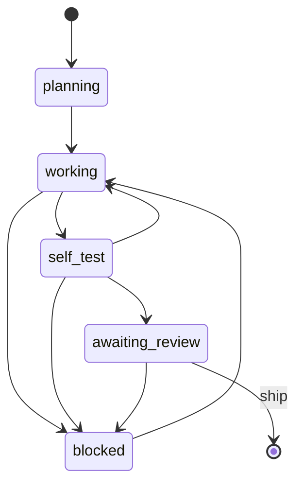

# argus - Deterministic Agent Supervisor

[](https://github.com/Elysium-Labs-EU/argus)

argus runs the mechanical half of multi-pane AI-agent supervision as plain Go instead of inside an LLM. It drives [herdr](https://github.com/ogulcancelik/herdr) (a terminal multiplexer) through its CLI, spawns worker agents in git worktrees, and reads each worker's typed status file rather than scraping terminal scrollback. The LLM re-enters only for the risky minority, the review of a diff that the deterministic gate would not clear on its own.

The point is not just to coordinate. argus is a verifier. The gate checks the real `git diff` (ground truth), not the worker's self-reported status; `ship` refuses to open a pull request without a recorded approving verdict; and argus's own control-plane files never leak into a PR.

## Features

* **Coordinator out of the LLM.** Discovering panes, enforcing one worktree per worker, spawning workers, and polling their state are plain code. Tokens are spent on judgment, not bookkeeping.
* **Typed status, not scrollback.** Each worker writes a single `status.json` after every phase; argus decodes that struct instead of parsing terminal output that a real agent would reflow or overwrite.
* **The gate verifies against git.** A worker's self-report only auto-approves where it matches the measured diff. An unmeasurable or under-reported diff escalates instead of sliding through — and no `--review` verdict can waive that escalation back to approved.
* **Verdict-gated shipping.** `ship` opens a PR only when a prior gate or review recorded an approving verdict, so a request-changes actually blocks the PR rather than being advisory.
* **Clean PRs.** argus unstages its own control-plane files before committing, so `.claude/argus` and scoped permission files never reach the pull request.
* **A run log you can query.** Every action lands in a typed event log under `~/.argus/runs`; `argus stats` aggregates it into escalation rate, review parse-fail rate, and tokens per task.

## How it works

argus splits supervision into a deterministic majority and a judgment minority.

The deterministic half discovers or opens herdr panes, creates a worktree per worker, writes a task brief, launches the worker in auto mode with a scoped permission file, then polls its status. A worker reports its phase with `argus worker report <phase>`, piping status JSON (files touched, tests run, diff stats, its plan/todo list) on stdin. Workers never write `status.json` directly. `report` checks the move against a fixed legal-transition table. Only a legal move gets persisted, and only argus stamps the timestamp.



`done` is never worker-reported. Only `ship` sets it, on merge. argus stops waiting once a worker hits a terminal phase: `awaiting_review` or `blocked`.

Then the gate runs. It checks the worker's reported status against a review policy (diff ceiling, shared-path globs, OS-integration globs needing real-world proof), then cross-checks against the diff argus measures from git. A clean match auto-approves. A miss, or a risky surface, escalates: to you, or with `--review`, to a headless `claude -p` review. That review is the only point the LLM re-enters the loop.

The design follows Adam Jacob's idea: move the coordinator out of the model, scale review intensity to risk. argus applies that idea to a supervise-agents workflow.

## Requirements

* Go 1.26 or newer, to build from source.
* [herdr](https://github.com/ogulcancelik/herdr) on PATH. argus talks to it only through its CLI.
* The `claude` CLI on PATH, for `argus review` and `supervise --review`.
* A forge token for the host the worktree points at (`GITHUB_TOKEN`, `CODEBERG_TOKEN`, `GITLAB_TOKEN` for gitlab.com, `FORGE_TOKEN` for any self-hosted Gitea/Forgejo, ...), for `argus ship`. If the env var isn't set, argus falls back to `gh auth token` on github.com, `glab auth token` on gitlab.com, or `git credential fill` elsewhere (Codeberg/Gitea) — the same non-interactive credential lookup `gh`/`glab` do for their own commands — so a caller never has to export the token into argus's process env itself. Self-hosted GitLab is not yet supported: only the exact host `gitlab.com` gets the GitLab API client — any other host, including a self-hosted GitLab, is treated as Gitea/Forgejo.
* `JIRA_BASE_URL`, `JIRA_EMAIL`, and `JIRA_API_TOKEN` — or a JSON config file at `$JIRA_CONFIG_FILE` or `~/.argus/jira.json` (`{"base_url":...,"email":...,"api_token":...}`) — only for `supervise --jira-issues`.

Every env var name above (a forge token, an agent key like `ANTHROPIC_API_KEY`) is just argus's built-in default, not a requirement to use exactly that name. Point argus at a different one with `--credential-env <name>=<ENV_VAR>` (`supervise`/`ship`/`rebase`), e.g. `--credential-env github.com=MY_GH_TOKEN --credential-env anthropic=MY_CLAUDE_KEY`, or persist it once with `argus config set credential.<name> <ENV_VAR>` so you don't have to repeat the flag every invocation. `supervise`'s credential proxy (see below) also fronts any agent key it can resolve this way, not just Anthropic's.

## Install

**From a release**
```bash
curl -sSfL https://raw.githubusercontent.com/Elysium-Labs-EU/argus/main/scripts/install.sh | sh
```

No sudo needed on most machines: the script installs to `~/.local/bin` when that
directory is already on `PATH`, and only falls back to `/usr/local/bin` (via
`sudo`, prompting if needed) when it isn't. Set `ARGUS_INSTALL_DIR` to install
somewhere else instead:
```bash
ARGUS_INSTALL_DIR=$HOME/bin sh -c "$(curl -sSfL https://raw.githubusercontent.com/Elysium-Labs-EU/argus/main/scripts/install.sh)"
```
Set `ARGUS_VERSION` to install a specific release tag instead of the latest one.

**From source**
```bash
git clone https://github.com/Elysium-Labs-EU/argus
cd argus
make build      # produces ./bin/argus
```

## Claude Code skill

argus ships a Claude Code skill that teaches the agent to drive these commands instead
of hand-running the supervise loop. When you work inside this repo, the copy at
`.claude/skills/argus/` is picked up automatically. To use it anywhere else, install the
distributable copy into your user skills directory:

```bash
mkdir -p ~/.claude/skills/argus
cp skills/argus/SKILL.md ~/.claude/skills/argus/SKILL.md
```

Then, in any repo with `argus` on PATH, ask Claude Code to "supervise the panes with
argus" and it will drive `supervise`, `review`, and `ship` for you.

## Quick Start

```bash
# Spawn two workers, each in its own worktree, and watch them through to review
argus supervise \
  --repo /path/to/project \
  --tasks "add retry to sink,fix log rotation" \
  --branches feat-retry,fix-rotation

# Turn on the LLM review path for changes the gate escalates
argus supervise --repo /path/to/project --tasks "risky change" --review

# Free-text briefs (commas, quotes) go in a file instead of --tasks, which is
# CSV-parsed and breaks on that punctuation: one brief per line.
argus supervise --repo /path/to/project --tasks-file briefs.txt --branches feat-a,feat-b

# Review one worktree's diff on demand
argus review --worktree /path/to/project-feat-retry --base origin/main

# A review came back request-changes: re-dispatch the same worker with the
# findings, loop gate/review until it clears (or --max-rounds is exhausted),
# and persist the resulting verdict so ship can see it
argus rework --worktree /path/to/project-feat-retry --base origin/main

# Ship an approved worktree to a pull request
argus ship --worktree /path/to/project-feat-retry --issue 42
```

## Commands

| Command | Description |
|---------|-------------|
| `argus supervise` | Discover or open panes, spawn workers in worktrees, gate their diffs, and watch each through to review |
| `argus supervise --review` | On a gate escalation, run a headless `claude -p` review instead of only surfacing the decision |
| `argus supervise --dry-run` | Print the plan and exit without creating worktrees or spawning workers |
| `argus supervise --tasks-file <path>` | Read one task per line from a file, appended after `--tasks`; not CSV-parsed, so free-text briefs with commas and quotes are safe |
| `argus supervise --issues <n,...>` | Fetch issue numbers from the repo's forge (GitHub/GitLab/Codeberg/Gitea) and turn each into a worker brief |
| `argus supervise --jira-issues <KEY,...>` | Fetch Jira Cloud issue keys (e.g. `PROJ-123`) and turn each into a worker brief |
| `argus review --worktree <path>` | Run a one-shot `claude -p` review of a worktree's diff against a base ref |
| `argus ship --worktree <path>` | Commit, push, and open a pull request (forge auto-detected), refused without an approving verdict unless `--force` |
| `argus rebase --worktree <path>` | Dispatch the worktree's own worker to resolve a post-merge conflict and force-push |
| `argus rework --worktree <path>` | Re-dispatch the worktree's own worker with a request-changes verdict's findings, loop the gate/review until it clears or `--max-rounds` is exhausted, and persist the resulting verdict so `ship` sees it |
| `argus stats` | Aggregate the run logs under `~/.argus/runs` into escalation rate, review parse-fail rate, and tokens per task |
| `argus config set credential.<name> <ENV_VAR>` | Persist which env var carries a credential (a forge host or agent-key name) to `~/.argus/config.toml`, so `--credential-env` doesn't need repeating every invocation |

Pass `--debug` on any command to tee the typed event log to stderr as it is written; the log is always persisted under `~/.argus/runs` regardless.

## The review gate

The gate is the cheap path. It auto-approves a worker only when the worker is actually ready for review, every reported test passed, the diff is within the ceiling, no shared path was touched, and any OS-integration change carries real-world proof. Everything else escalates with a recorded reason.

Three of those checks the worker cannot talk its way past, because argus verifies against ground truth instead of trusting `status.json`:

* If argus cannot measure the diff, the self-report is unverifiable and the change escalates.
* If the measured diff materially exceeds what the worker claimed, argus treats it as an under-report and escalates.
* If the worker's session transcript has no real `TodoWrite`/`TaskCreate` tool call, a `planning` report's `plan` field is an unverified claim and the change escalates. The same evidence also gates the `planning` -> `working` move itself: that transition is rejected outright if the planning report on file never carried a non-empty `plan` array.

The unmeasurable-diff and under-report checks (plus a zero-measured-files check for a claimed terminal phase) are not just escalations — they are hard reasons a `--review` verdict cannot waive. Even if the LLM reviewer comes back "approve", argus still records the change as not approved when one of these fired, because the discrepancy is evidence `status.json` can't be trusted for that change, not a call for the reviewer's holistic judgment.

Tune the gate with `--max-diff-lines`, `--shared-glob`, and `--os-glob` on `supervise`.

## Development

argus follows the same conventions as its sibling repos. Commands live in `cmd/` as cobra `newXxxCmd` constructors; everything else lives in `internal/` (there is no `pkg/`). All work goes through `make`.

```bash
make build   # build ./bin/argus
make test    # go test -race
make ci      # test, lint, nilaway, coverage gate, change-scoped risk gate
make fix     # gofmt and struct field alignment
```

`make ci` runs the full local gate: tests with the race detector, golangci-lint v2, nilaway nil-safety analysis, a coverage floor of 75 percent, and a go-crap change-risk check scoped to the functions you changed against `origin/main`. Run `make help` for the complete target list.

## License

Apache License 2.0 - see [LICENSE](LICENSE).
